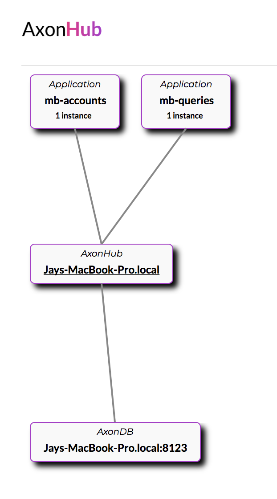

# mini-bank

## Pre-requisites
- Axon Hub 1.1
- Axon DB 1.3.5
- MySQL
- Java 8

## Running the application

1. Update the axonhub.properties

This property will be commented. Please uncomment and set localhost as its value

```properties
# Comma-separated list of AxonDB servers
axoniq.axondb.servers=localhost
```

2. Run axondb-server

```java
java -jar axondb-server.jar
```

3. Run axonhub-server

```java
java -jar axonhub-server.jar
```

4. Start mysql
5. Start mb-query

```maven
mvn clean spring-boot:run 
```
6. Start mb-command

```maven
mvn clean spring-boot:run 
```

You can verify the setup by opening Axon Hub url. You should see an overview similar to the following image.
 



7. Start mb-gui

```maven
mvn clean spring-boot:run 
```

## Useful links - Local Server

- [Axon Hub](http://localhost:8024)
- [Axon DB](http://localhost:8023)
- [GUI](http://localhost:8080)
